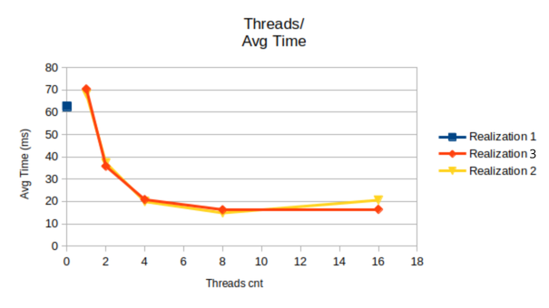
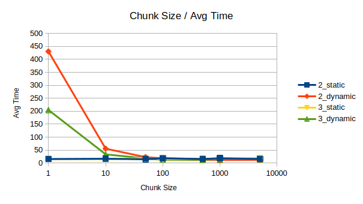

| Лабораторная работа №4  | 24.Б10                    | Архитектура компьютера |
| ----------------------- | ------------------------- | ---------------------- |
| Оптимизация по скорости | Кашенин Андрей Дмитриевич | 2025                   |

## Инструментарий

- Язык: C++20, OpenMP 4.
- Компилятор: clang++ (CMake, пресет Release), сборка с `-O3 -fopenmp` (LLVM OpenMP runtime).
- ОС: Linux (Ubuntu 24.04)

## Аппаратная платформа

- Процессор: AMD Ryzen 7 6800HS (8 физических ядер, 16 логических потоков)
- Архитектура: x86_64 (Zen 3+)
- Базовая частота: 3.2 ГГц
- Turbo Boost: до 4.787 ГГц
- Кэш L3: 16 МБ
- Потоков на ядро: 2 (SMT включен)

## Что реализовано

- Метод Монте‑Карло для объёма пиформы (a=2) с тремя вариантами:
  - однопоточно без OpenMP;
  - `omp parallel for` с разными `schedule` и `chunk_size`;
  - потоки через OpenMP, распределение работы вручную (static stride и динамическое fetch_add).
- Парсинг CLI аргументов `--input/--output/--realization/--threads/--kind/--chunk_size`.
- Генератор псевдослучайных чисел с раздельным сдвигом состояния на поток.
- Автоматизированные замеры (10 повторов), результаты сведены в графики в `assets/`.

## Структура проекта

- `main.cpp` — парсинг аргументов, выбор варианта реализации, измерение времени.
- `include/` — объявления: геометрия (`hit.h`), парсер аргументов, генератор `Rnd`, реализации 1–3.
- `src/` — определения: ядро геометрии, генератор, реализации 1–3, парсер CLI.
- `assets/` — итоговые графики производительности.

## Результат и параметры по умолчанию

- Формат stdout: `Time (%i thread(s)): %g ms` (число потоков = 0 для однопоточного варианта), ответ пишется в выходной файл строкой `%g\n`.
- Если `--threads` не указан, используется `omp_get_max_threads()`.
- Для варианта 2 по умолчанию: `kind=dynamic`, `chunk_size=600`.
- Для варианта 3 по умолчанию: `kind=dynamic`, `chunk_size=600`.
- Значения `--kind`/`--chunk_size` переопределяются аргументами, static применяется только если явно указан.

## Описание решения

### Геометрия и входные данные

- Фигура: piriform, a=2; тестовая аппроксимация попадания реализована в проекте. Диапазоны осей: `[-2;2]^3`, см. `get_axis_range()`.
- Число точек `N` читается из `--input`; в тестах использовано с `N=10_000_000`.

### Генератор случайных чисел

- Класс `Rnd`: 256‑битное состояние, смесь XOR/rotl (аналог семейства xoshiro). Возвращает 64‑битные значения, `next_float()` берёт старшие биты и масштабирует к `[0,1)`.
- Инициализация: базовое зерно 123456789, для потока `tid` добавляется `tid*1_000_003` для декорреляции.
- Почему выбран: быстрые побитовые операции без деления, одинаково работает на Linux/macOS, независимость потоков обеспечивается разносом seed, отсутствие глобального состояния снижает ложные зависимости по памяти.

### Варианты реализаций

- **Realization1**: однопоточный цикл, один генератор, счётчик попаданий, итоговый объём = доля попаданий × объём параллелепипеда.
- **Realization2**: `#pragma omp parallel` + `omp for` с явным `schedule(static|dynamic, chunk_size)`. Локальные счётчики векторами, финальное суммирование в одном потоке.
- **Realization3** static: ручной страйдинг `for (i += threads)` внутри каждого потока.
- **Realization3** dynamic: глобальный атомарный `fetch_add(chunk)` раздаёт блоки; каждый поток считает локально и пишет в `local_hits`.

### OpenMP: используемые конструкции

- `#pragma omp parallel` — создание пулов потоков для варианта 2 и 3.
- `#pragma omp for schedule(kind, chunk)` — автоматическое распределение итераций (variant 2), без `reduction`, суммирование делается вручную по локальным буферам.
- Атомарный `fetch_add` (через `std::atomic` в variant 3 dynamic) — дешёвая раздача чанков без планировщика OpenMP.
- Локальные генераторы и счётчики на поток — чтобы исключить ложное совместное использование кэша.

## Тестирование и результаты

- Условия: `N=10_000_000`, 10 повторов для усреднения, сборка Release (`-O3 -fopenmp`), ОС Ubuntu 24.04, CPU Ryzen 7 6800HS.

Примечание: 0 потоков в реализации один означает, что всё выполнялось в одном потоке

- Графики:

  - Зависимость времени от потоков (static chunk=100): 
  - Влияние chunk_size и schedule (8 потоков): 

  - Оптимальные конфигурации по потокам: 

- Ключевые численные результаты (AvgTime_ms, 10 запусков):

  - Realization1 (1 поток): 56.25–62.60 ms.
  - Realization2 static chunk=100: 64.86 ms (1), 18.40 ms (8), 24.04 ms (16).
  - Realization3 static chunk=100: 70.43 ms (1), 16.24 ms (8), 15.58 ms (16).
  - Realization2 dynamic, chunk sweep (8 потоков): минимум 12.06 ms при chunk=1000.
  - Realization3 dynamic, chunk sweep (8 потоков): минимум 11.49 ms при chunk=500.

### Выводы

- Ускорение почти линейно до 8 потоков; далее возникает плато из‑за накладных расходов (кеш/NUMA/LLC, планировщик).
- Dynamic с средним/крупным `chunk` (500–1000) снижает overhead и лучше балансирует «хвост»; слишком малые чанки (≤10) резко ухудшают время.
- Вариант 3 (ручная динамика, `chunk≈500`) на 8 потоках быстрее варианта 2 (`dynamic`, `chunk≈1000`) на ~5–10% благодаря дешёвой раздаче блоков через атомарный счётчик.
- Static целесообразен при малом числе потоков; при 8+ потоках преимущество у dynamic за счёт балансировки.
- Локальные генераторы и счётчики на поток уменьшают ложное совместное использование кеша и синхронизацию, улучшая масштабируемость.

## Запуск

Примеры (путь к бинарю `build/run` зависит от CMake):

- Однопоточно: `./run --input test_input.txt --output out.txt --realization 1`
- Вариант 2 с явными параметрами: `./run --input test_input.txt --output out.txt --realization 2 --threads 8 --kind dynamic --chunk_size 1000`
- Вариант 3 с оптимальными по умолчанию: `./run --input test_input.txt --output out.txt --realization 3 --threads 8`

## Итог

- Получено ускорение ~5× относительно однопоточного базиса при 8 потоках и оптимальных chunk.
- Самая быстрая конфигурация: Realization3, dynamic, chunk≈500, 8 потоков.
